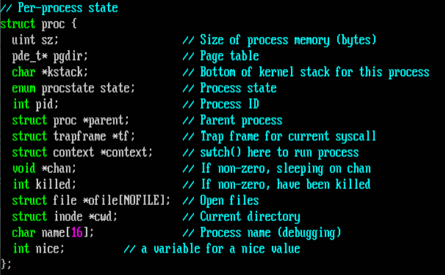
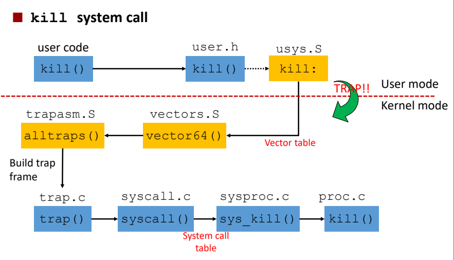
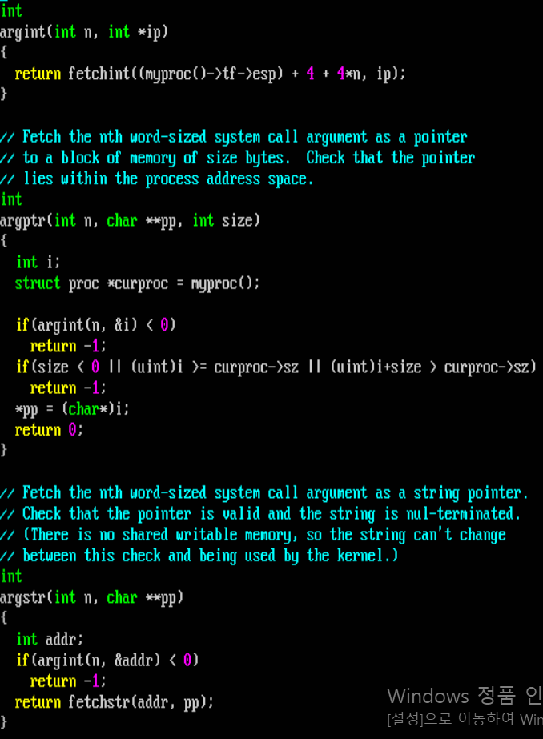
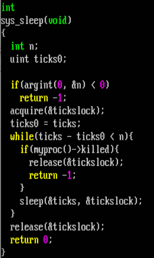
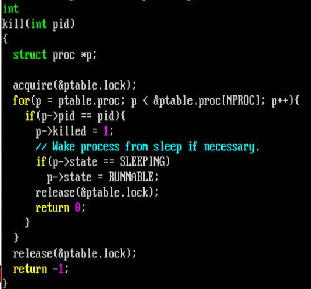
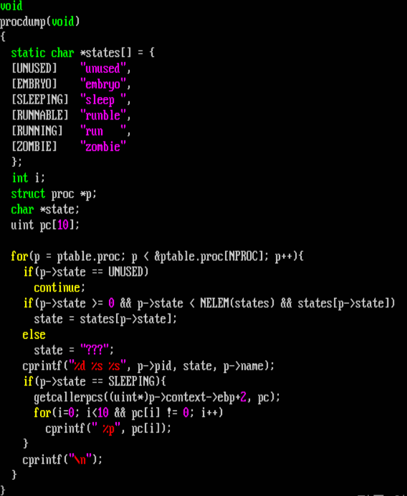
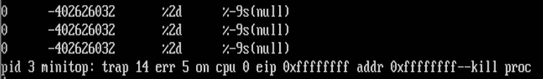
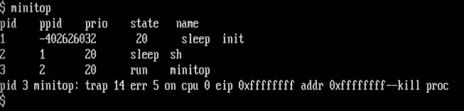
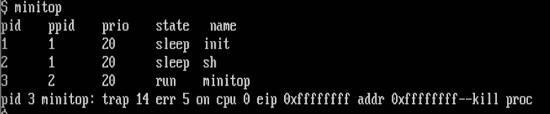
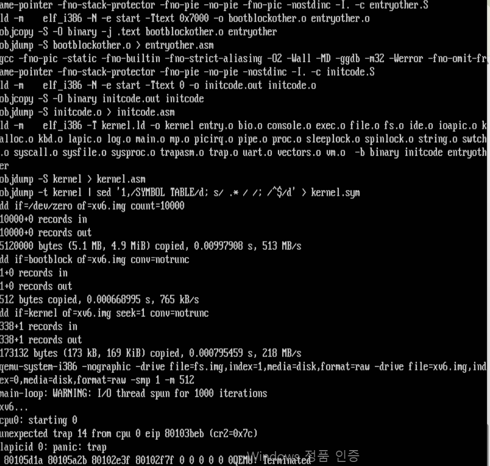

# Project #2. Priority Scheduler
## 1. Implement system calls related to process priority
- setnice(), getnice(), ps()
- I will do this on this branch!
## 2. Implement priority-based scheduler on xv6
- The lower nice value, the higher priority
- The highest priority process is selected for next running
- Tiebreak: FIFO fashion
- on the branch OS-hw3. not now.
## reference

  
proc struct

  

  
Trap Handling Process

  
  
  - The `kill()` used in the user program is generated through user.h and usys.S
  - The `kill()` used in the `sys_kill()` and The `kill()` used in the user program are not the same
  - This also applies to `fork()`, `setnice()`, `getnice()`, `ps()`, ...

  
How system call parameters are passed

  - use `argint`, `argptr`, `argstr` in syscall.c
    
 
      
view argint, argptr, argstr codes

  
      
    

    

      
view sys_sleep code using argint to get parameter

      
    

  
How to get the process corresponding to a given pid

  

  
How to print state

  - There is a different appoach to implement printing process state
  

## Trouble Shooting

  
minitop error1

  - 예상치 못한 출력  
  
  - unused proc 예외처리 로직 추가  
  
  - userinit에 p->parent = p; 추가  
  
  

  
scheduler error1

  - scheduler 첫 완성 후 생긴 버그  
  
    

